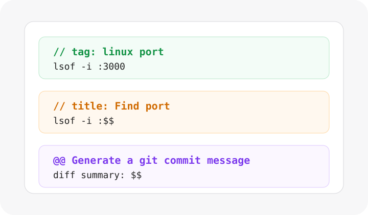
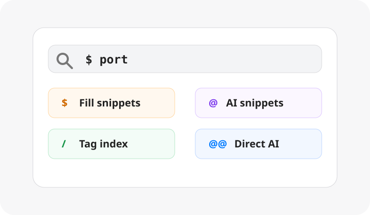
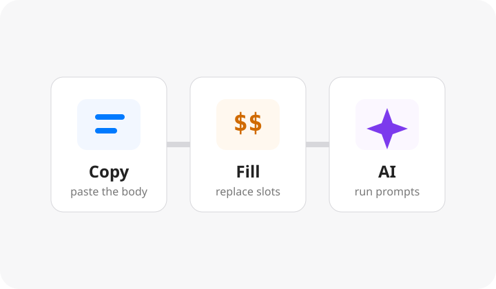

# Snowbo Snippets

Snowbo Snippets 是一款极简片段管理工具。没有复杂的 UI 交互，可以像写代码一样快速沉淀命令、回复、提示词和小流程，结合简单的标记语法把其中可复用的部分。通过一个小弹窗，支持 **Copy** 快速复制、**Fill** 替换与 **AI** 生成片段内容至剪贴板。


## 核心能力

<p>
  
  
  
</p>

- **从普通笔记生成片段**：用 `--` 拆分片段，用 `//` 写标题和标签，用 `$$` 留出替换输入槽，用 `@@` 绑定 AI 提示词。
- **搜索优先的快捷窗口**：普通输入搜索全部内容；`$`、`@`、`@@`、`/` 分别进入 Fill、AI、直接 AI 和标签搜索。
- **三种日常动作**：直接复制正文、一次输入替换多个占位符、调用保存好的提示词并复制 AI 结果。
- **面向开发者场景**：适合保存 Linux 命令、Git commit message 提示词、Shell 排错说明、常用回复和轻量 runbook。

## 快捷窗口

| 前缀 | 用途 | 示例 |
| --- | --- | --- |
| 普通输入 | 搜索标题、正文、标签、AI 指令和来源笔记 | `port` |
| `$` | 只看带 `$$` 输入槽的片段，并默认执行 Fill | `$ port` |
| `@` | 只看带 `@@` 指令的片段，并默认执行 AI | `@ commit` |
| `@@` | 不引用片段，直接和 AI 对话 | `@@ explain this shell error` |
| `/` | 只按 tag / alias 搜索，不匹配正文 | `/ linux` |

`Enter` 执行当前动作。`Esc` 从 Fill / AI 输入阶段回到搜索，再按一次关闭窗口。

## 片段标记

```text
// title: 查端口占用
// tag: linux port network
lsof -i :$$
--
// title: 查看目录大小
// tag: linux disk size
du -sh $$
--
// title: Git commit message
// tag: git ai commit
@@ 根据下面的 diff 摘要生成一行 conventional commit message
$$
```

标记行只用于组织快捷窗口，不会进入最终复制的正文。

## 开发

```bash
npm install
npm run dev
```

启动桌面端：

```bash
npm run tauri:dev
```

构建：

```bash
npm run build
npm run tauri:build
```

## 技术栈

- Next.js App Router
- React
- Tauri
- CodeMirror
- Jotai

## 许可证

MIT
